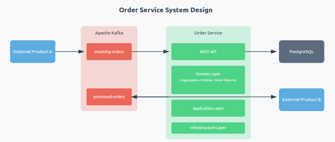

# Order Service

Serviço responsável pelo gerenciamento e processamento de pedidos, implementado usando Clean Architecture e Domain-Driven Design (DDD).

## Arquitetura

O serviço recebe pedidos via Kafka de um Produto Externo A, processa estes pedidos e envia o resultado para um Produto Externo B, também via Kafka.



### Fluxo de Processamento
1. Recebimento do pedido via tópico `incoming-orders`
2. Validação e persistência do pedido
3. Processamento e cálculo dos valores
4. Envio do pedido processado via tópico `processed-orders`

### Estados do Pedido
- RECEIVED: Pedido recebido
- PROCESSING: Em processamento
- CALCULATING: Calculando valores
- CALCULATED: Valores calculados
- COMPLETED: Processamento finalizado
- ERROR: Erro no processamento

## Tecnologias Utilizadas

- Java 17
- Spring Boot 3.2.3
- PostgreSQL 14
- Apache Kafka
- Docker
- Maven

## Configuração e Execução

### Pré-requisitos
- Docker e Docker Compose
- Java 17
- Maven

### Executando a Aplicação

1. Clone o repositório:
```bash
git clone [url-do-repositorio] order-service
cd order-service
```

2. Execute os containers:
```bash
docker-compose up -d
```

3. Verifique se todos os serviços estão rodando:
```bash
docker-compose ps
```

### Serviços e Portas

- Order Service: http://localhost:8081
- Kafka UI: http://localhost:8080
- PostgreSQL: localhost:5432
- Kafka: localhost:29092
- Documentação via Swagger: http://localhost:8081/swagger-ui/index.html

### Testando a Aplicação

1. Acesse o Kafka UI (http://localhost:8080)
2. Navegue até o tópico `incoming-orders`
3. Envie uma mensagem no formato:
```json
{
  "externalOrderId": "ORDER-001",
  "items": [
    {
      "productId": "PROD-001",
      "productName": "Product 1",
      "quantity": 2,
      "unitPrice": 100.00
    }
  ],
  "receivedAt": "2024-03-14T10:30:00"
}
```
4. Verifique o processamento:
   - Logs da aplicação: `docker-compose logs -f app`
   - Tópico `processed-orders` no Kafka UI
   - Consulta do pedido via API: GET http://localhost:8081/api/orders/{orderId}

## API Endpoints

### GET /api/orders/{orderId}
Retorna os detalhes de um pedido específico.

**Resposta de Sucesso (200 OK)**
```json
{
  "id": "123e4567-e89b-12d3-a456-426614174000",
  "externalOrderId": "ORDER-001",
  "status": "COMPLETED",
  "totalAmount": 200.00,
  "items": [
    {
      "productId": "PROD-001",
      "productName": "Product 1",
      "quantity": 2,
      "unitPrice": 100.00,
      "totalPrice": 200.00
    }
  ]
}
```

## Desenvolvimento

### Executando Testes
```bash
mvn test
```

### Builds
```bash
mvn clean install
```

### Parando a Aplicação
```bash
docker-compose down
```

Para remover volumes:
```bash
docker-compose down -v
```

### Autor

Linkedin: https://www.linkedin.com/in/bruno-f-moraes/

email: brunofelipedk@gmail.com
